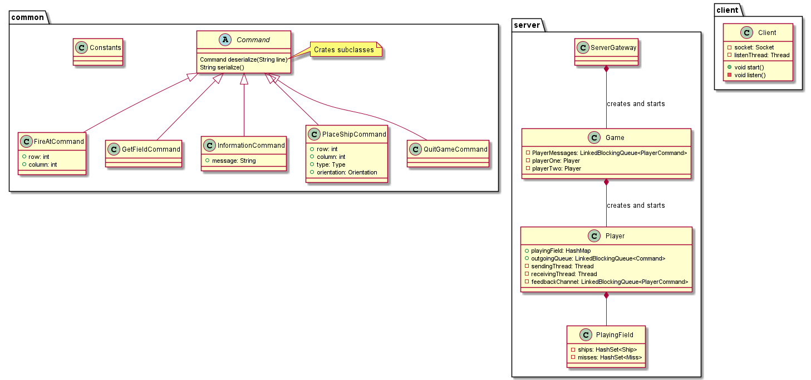

#Battleships
## How to build
These applications contain two main methods, ClientMain and ServerMain in the Client/Server packages.

In IntelliJ go to file -> project structure -> artifacts and add each Main in its own artifact with the META-INF from the same folder

## How to run
Server jar runs by default on port 5555. Port can be changed via the first parameter`java -jar Server.jar <customPort>`\
Clients by default connect to localhost:5555, custom ports/remote addresses can be connected to like such `java -jar Client.jar <customHost> <customPort>` or `java -jar Client.jar <customHost>`

Once the server has been contacted by two clients it starts a new game session, Clients will get a Hello World message and can then begin placing their ships.

Enter ? to get a view of your, and the opponent's boards.

Place ships by entering the initial letter of the ship, press enter and follow the prompts.\
    Ships available are Carrier(4 long) Battleship(3 long) Destroyer(2 long) Submarine(1 long)

Firing at the opponent will only work once both players have finished placing all their ships, a message will be shown. 

Fire at the opponent by entering F and following the prompts. If it was your turn to fire you'll get a printout of the opponents board, and a MISS/HIT message.

If either side's ships have all been destroyed the game functionally ends. Both players can still get a current state of the boards but no other actions will have effect.

## Architecture

### Server
The Server listens until two players have connected and then transfers their sockets into control of a Game object.

The Game manages the game logic and communication with two players with a sending, and a receiving thread for each player.\
Commands from the clients are fed back into a Queue of commands the main Game thread processes.\
Similarly, the sending threads only process a Queue of commands and prints the serialized version into the socket.

### Client
The Client consists of two threads, the UI thread which processes user input and sends commands to the server, and the listening thread which prints out deserialized Commands received from the Server.\
The Client has no knowledge of game state, it is purely a front-end for creating and receiving Commands.

### Commands
Commands are the shared classes used for serializing and deserializing communication between Server and Client. Command has a static factory method for creating appropriate subclasses with their parameters. Any data that can't be serialized into a Command causes an exception.\
The commands are commands such as placing a ship, firing at an opponent or quitting the game.
All communication has to happen through objects of the classes `common.commands`

